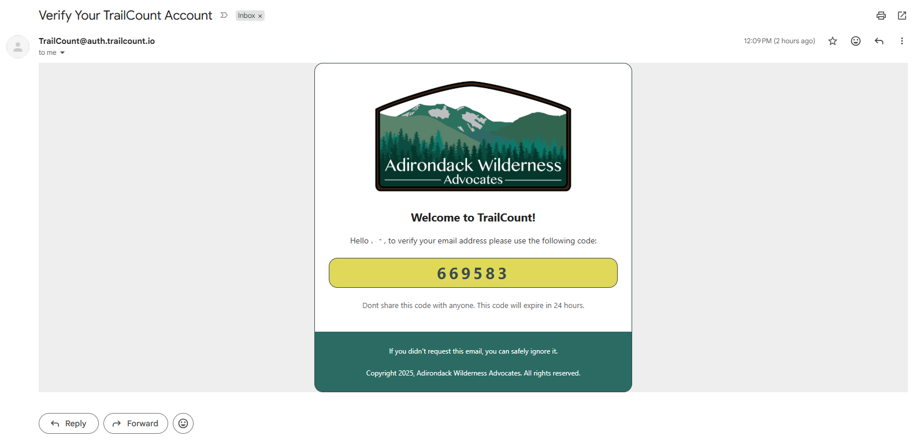
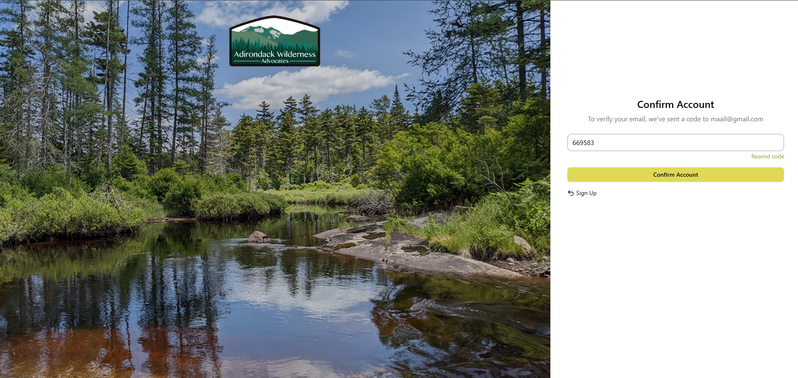

# Verify Registered Account

## Preconditions
1. Not registered

## Test Steps & Expected Results

| Step | Action Description | Expected Result | Pass/Fail |
| :--- | :--- | :--- | :--- |
| 1 | Click on the **"Guest"** button in the top navigation bar. Then, **Login/Register** | Redirected to the login page (`/login`). URL is updated. | [x] Pass   [ ] Fail |
| 2 | Click on the **"Create an account ->"** button on the bottom by "Don't have an account?". | Text displays correctly without masking. | [x] Pass   [ ] Fail |
| 3 | Choose a unique username. Type your email into the email field. | Text displays correctly without masking. | [x] Pass   [ ] Fail |
| 4 | Enter valid password into the password input. Retype the password to confirm it. | Characters display as masked dots (`•••••`) for privacy. | [x] Pass   [ ] Fail |
| 5 | Click the Yellow **"Sign Up"** button. | Redirected to the home page (`/home`). | [x] Pass   [ ] Fail |
| 6 | Redirected to "Confirm Account" Page. Enter the code that was emailed to you. | Redirected to "Login" Page with your credentials filled in. | [x] Pass   [ ] Fail |
|||! | 
| 7 | Click the Yellow **"Login"** button. | Username space displays: **Role**, Username | [x] Pass   [ ] Fail |
| 58 | Verify change in username on the top right in the navigation bar. | Username space displays: **Username**, **User** | [x] Pass   [ ] Fail |

## Post-conditions
* A secure session cookie is established in the browser storage.
* User is left in an authenticated dashboard state.